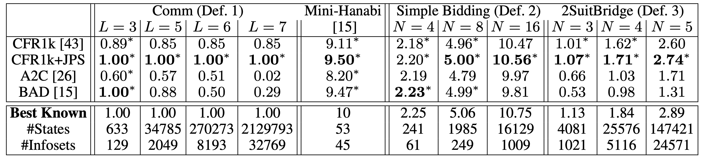
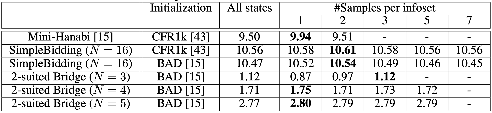

## Overview

Code for "Joint Policy Search for Collaborative Multi-agent Imperfect Information Games". Arxiv [link](https://arxiv.org/abs/2008.06495). The paper is published in NeurIPS 2020.

The project aims to find better equilibrium in multi-agent collaborative games with imperfect information by improving the policies of multiple agents simultaneously. This helps escape local equilibrium where unlaterial improvement of one player's policy is not helpful. To achieve that, we developed a novel value decomposition technique that decomposes the expected value changes into information sets where the policy differs, and search over candidate information sets via depth-first search. Each update can be proven not to degrade the performance in the tabular cases.

We open source the code to reproduce our results in simple games (see Def. 1-3 in the paper). The dataset and pre-trained Bridge model will be released later.

```
@inproceedings{tian2020jps,
    title={Joint Policy Search for Multi-agent Collaboration with Imperfect Information},
    author={Yuandong Tian and Qucheng Gong and Tina Jiang},
    booktitle={NeurIPS},
    year={2020}
}
```

## Requirements

Compiled with Linux and GCC 7.4
Pytorch 1.5+ (libtorch)

## Compilation

First initialize all submodules:

```
git submodule update --init --recursive
```

Then go to `simple_game`, and do the following to build 
```
mkdir build
cd build
cmake .. 
make
``` 
The executable `jps` is in `./build`.


## Examples 
To start, in the `build` directory, run the following to get CFR1k+JPS solution for Mini-Hanabi. Log [here](./simple_game/log/log2.txt): 
```
./jps --game comm2 --iter 100 --iter_cfr 1000
```
You might run with `--num_samples 1` to get the results for sampled-based version. E.g., run the following to get results of 100 trials:
```

for i in `seq 1 100`; do ./jps --game comm2 --iter 100 --iter_cfr 1000 --seed $i --num_samples 1; done > aa.txt
grep "CFRPure" aa.txt
```

Another example: Simple Bidding (N=16, d=3). Log [here](./simple_game/log/log1.txt).
```
./jps --game simplebidding --seed 1 --iter 100 --N_minibridge 16 --iter_cfr 1000 --max_depth 3
```

There are a few tabular imperfect information collaborative games implemented:
+ `comm`: Simple Communication Game (Def. 1 in the paper)
+ `simplebidding`: Simple Bidding (Def. 2 in the paper) 
+ `2suitedbridge`: 2-Suit Mini-Bridge (Def. 3 in the paper)
+ `comm2`: Mini-Hanabi introduced in [BAD paper](https://arxiv.org/abs/1811.01458).

Result


Results of sample-based approach


## Visualize policy (for simple bidding)
In `build` folder, do:

```
./jps --game=simplebidding --N_minibridge=4 --seed=2 > aa.txt
python ../load_strategies.py --log aa.txt
```

The output is:
```
Optimal policies
score: 2.1875
        0       1        2        3
0  10 (0)  10 (1)  120 (2)  120 (2)
1  20 (0)  20 (2)   20 (2)  230 (4)
2  20 (2)  20 (2)   20 (2)  230 (4)
3  30 (0)  30 (4)   30 (4)   30 (4)
```
Note that "120" means P1 first bids 1, P2 then bids 2 and P1 bids 0 (Pass). The final contract is 2^{2-1} = 2, if card1 + card2 >= 2, then both of the players get reward 2 (shown in the parentheses), otherwise 0.

# Bridge Dataset
Please download the dataset [here](https://dl.fbaipublicfiles.com/bridge/bridge_dataset.tar.gz). The training set (dda.db) contains 2.5M situations, each with a pre-computed double dummy table. The database file can be opened by sqlite3.  
```
$ sqlite3
SQLite version 3.31.1 2020-01-27 19:55:54
Enter ".help" for usage hints.
Connected to a transient in-memory database.
Use ".open FILENAME" to reopen on a persistent database.
sqlite> .open dda.db
sqlite> select * from records limit 1;
0|{"pbn": "[Deal \"N:KT9743.AQT43.J.7 J85.9.Q6.KQJ9532 Q2.KJ765.T98.T64 A6.82.AK75432.A8\"]", "ddt": [0, 12, 0, 12, 0, 12, 0, 12, 10, 3, 10, 3, 9, 4, 9, 4, 0, 8, 0, 8]}
```

DDS table is in the format of C (NESW), D (NESW), H (NESW), S (NESW), NT (NESW). For example, the 1D ddt table above means that
|   | C  | D  | H  | S | NT |
|---|----|----|----|---|----|
| N | 0  | 0  | 10 | 9 | 0  |
| E | 12 | 12 | 3  | 4 | 8  |
| S | 0  | 0  | 10 | 9 | 0  |
| W | 12 | 12 | 3  | 4 | 8  |

# Logs of our 14 days model
Please check [here](./logs/jps_14days.log) for a complete log against WBridge5. Here is an explanation about the log entry:

```
dealer is 0 [Vulnerability None]                                                      # The dealer is 0, no Vulnerability
[Deal "N:AK.J982.Q986.Q65 JT97.QT5.A5.AKJ7 Q82.AK743.32.T83 6543.6.KJT74.942"]        # All 4 hands
parScore: -140

Seat ♠   ♥   ♦   ♣   HCP   Actual Hand
0    2   4   4   3   12   ♠AK ♥J982 ♦Q986 ♣Q65                                        
1    4   3   2   4   15   ♠JT97 ♥QT5 ♦A5 ♣AKJ7                                        
2    3   5   2   3   9    ♠Q82 ♥AK743 ♦32 ♣T83
3    4   1   5   3   4    ♠6543 ♥6 ♦KJT74 ♣942

# At table 0, JPS at Seat 0 and Seat 2 (two AI doesn't know each other's hands), and WBridge5 at Seat 1 and Seat 3
# At table 1, JPS at Seat 1 and Seat 3, and WBridge5 at Seat 0 and Seat 2
# Bids in parentheses are from WBridge5 (the opponent)

Table 0, dealer: 0  1H (1N) P (P) P                                                   # Bidding. Seat 0 -> 1 -> 2 -> 3. JPS bids 1H, WBridge5 bids 1N (contract) 
Table 1, dealer: 0  (1D) P (1H) P (2H) X (3H) P (P) P                                 # Bidding. WBridge5 bids 1D, JPS bids P, Wbridge5 bids 1H, then 2H, then 3H (contract)

Table 0, Trick taken by declarer: 5, rawNSSeatScore: 100                              # Result After DDS. 1N down 2, declarer (Wbridge5) loses 100 points and JPS won 100 points.  
Table 1, Trick taken by declarer: 8, rawNSSeatScore: -50                              # 3H down 1, declarer (WBridge5) loses 50 points and JPS won 50 points. 
Final reward 0.166667                                                                 # Convert the two table scores into normalized IMPs (= IMP / 24) 
```

To compute the overall performance given these logs, please run the following script:
```
./jps$ python compute_score.py --log_file ./logs/jps_3days.log
mean = 0.442, std = 0.1993448629244666

./jps$ python compute_score.py --log_file ./logs/jps_14days.log
mean = 0.628, std = 0.1944979317253668
```

Note that the original log had one bug that miscalculated the declarer (the declarer should be the first player calling for the strain of the final contract, rather than the last player who finalizes it). This affects the `Final reward` entry so a simple `grep "Final reward" [log file]` didn't give you the right answer. Instead we provide you with `compute_score.py` to compute the final score correctly, with the help of DDS table of the 1k games stored in `./logs/against_WBridge5.raw`. 

The pre-trained model, as well as the C++ code that runs it, will be released soon. 

## Contribution
See the [CONTRIBUTING](CONTRIBUTING.md) file for how to help out.

## License
JPS is under CC-BY-NC 4.0 license, as found in the LICENSE file.
