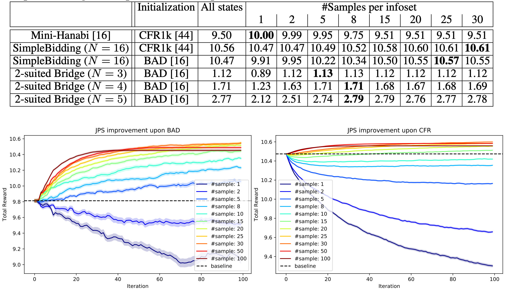

## Overview

Code for "Joint Policy Search for Collaborative Multi-agent Imperfect Information Games". Arxiv [link](https://arxiv.org/abs/2008.06495).

The project aims to find better equilibrium in multi-agent collaborative games by changing the policy of multiple agents simultaneously. This helps escape local equilibrium where unlaterial improvement of one player's policy is not helpful. We open source the code to reproduce our results in simple games (see Def. 1-3 in the paper). The pre-trained Bridge model will be released later.

```
@misc{tian2020jps,
    title={Joint Policy Search for Multi-agent Collaboration with Imperfect Information},
    author={Yuandong Tian and Qucheng Gong and Tina Jiang},
    year={2020},
    eprint={2008.06495},
    archivePrefix={arXiv},
    primaryClass={cs.LG}
}
```

## Requirements

Compiled with Linux and GCC 7.4
Pytorch 1.5+ (libtorch)

## Compilation

First initialize all submodules:

```
git submodule update --init --recursive
```

Then go to `simple_game`, and do the following to build 
```
mkdir build
cd build
cmake .. 
make
``` 
The executable `jps` is in `./build`.


## Examples 
To start, in the `build` directory, run the following to get CFR1k+JPS solution for Mini-Hanabi. Log [here](./simple_game/log/log2.txt): 
```
./jps --game comm2 --iter 100 --iter_cfr 1000
```
You might run with `--num_samples 1` to get the results for sampled-based version. E.g., run the following to get results of 100 trials:
```

for i in `seq 1 100`; do ./jps --game comm2 --iter 100 --iter_cfr 1000 --seed $i --num_samples 1; done > aa.txt
grep "CFRPure" aa.txt
```

Another example: Simple Bidding (N=16, d=3). Log [here](./simple_game/log/log1.txt).
```
./jps --game simplebidding --seed 1 --iter 100 --N_minibridge 16 --iter_cfr 1000 --max_depth 3
```

There are a few tabular imperfect information collaborative games implemented:
+ `comm`: Simple Communication Game (Def. 1 in the paper)
+ `simplebidding`: Simple Bidding (Def. 2 in the paper) 
+ `2suitedbridge`: 2-Suit Mini-Bridge (Def. 3 in the paper)
+ `comm2`: Mini-Hanabi introduced in [BAD paper](https://arxiv.org/abs/1811.01458).

Result


Results of sample-based approach


## Contribution
See the [CONTRIBUTING](CONTRIBUTING.md) file for how to help out.

## License
JPS is under CC-BY-NC 4.0 license, as found in the LICENSE file.
